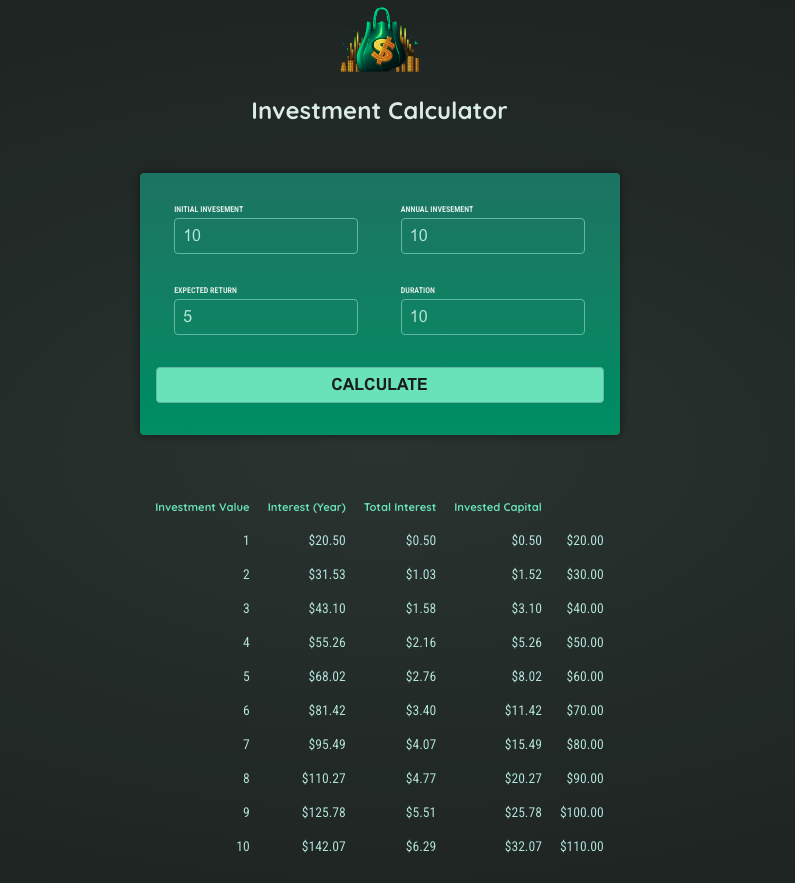

# InvestmentCalculator
A professional Angular app that estimates how an investment grows over time.

## Overview
Enter initial investment, annual contribution, expected return (%), and duration (years). The app computes a year-by-year table showing invested capital, interest earned per year, total interest accumulated, and final value.

## Features
- Inputs: initial investment, annual investment, expected return (%), duration (years)
- Yearly breakdown: investment value, interest (per year), total interest, invested capital
- Clean, responsive UI

## Tech Stack
- Angular, TypeScript, CSS/SCSS, npm

## Getting Started

Prerequisites  
    node -v  
    npm -v  
    ng version

Installation  
    git clone https://github.com/ramyashreemk44/InvestmentCalculator.git  
    cd InvestmentCalculator  
    npm install

Run the app  
    ng serve  
Open http://localhost:4200 in your browser.

Build for production  
    ng build  
The output will be in the dist/ folder.

## Screenshots
Place your screenshots in a tracked folder and reference them with a relative path.

Create folder (once)  
    mkdir -p assets/screenshots

Move your image there (example)  
    mv app-dashboard.png assets/screenshots/app-dashboard.png

Include in README  

Tip: paths are case-sensitive. To control size, you can use HTML instead:

## Future Enhancements
- Line or bar chart for growth over time
- Multiple currency support
- Monthly contribution option
- Dark/light theme toggle
